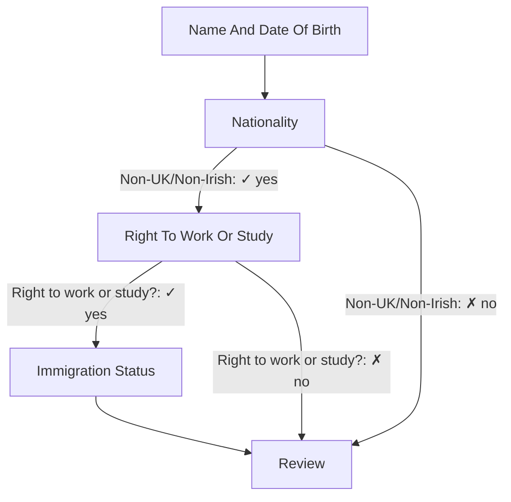

# DfE::Wizard — Multi-Step Form Framework for Ruby on Rails

**A powerful, flexible wizard framework for building complex multi-step forms with
conditional branching, state management, logging and testing and auto generated documentation.**

- **Version**: 1.0.0.beta

DfE::Wizard 1.0.0 is currently in **beta**, and is ideal for people who want to experiment with its API,
patterns, and behaviours before the official 1.0 release.

Please use it in non-critical projects or in development environment first, report bugs, and share
feedback so the final version can be more stable and developer-friendly.

---

## Table of Contents

1. [Architecture Overview](#architecture-overview)
2. [Installation](#installation)
3. [Core Concepts](#core-concepts)
   - [Steps Processor (Flow)](#steps-processor-flow)
   - [Step (Form Object)](#step-form-object)
   - [State Store](#state-store)
   - [Repository](#repository)
   - [Step Operators (Optional)](#step-operators-optional)
   - [Routing (Optional)](#routing-optional)
   - [Logging (Optional)](#logging-optional)
   - [Inspect (Optional)](#inspect-optional)
4. [Quick Start](#quick-start)
5. [Usage Guide](#usage-guide)
5. [Testing](#testing)
7. [Auto generated documentation](#auto-generated-documentation)
8. [Wizard Examples](#wizard-examples)
9. [API Reference](#api-reference)
10. [Troubleshooting](#troubleshooting)
11. [Support](#support)
12. [Contact](#contact)

---

## Architecture Overview

```
┌─────────────────────────────────────────────────────────────────────────┐
│                         WIZARD (Orchestrator)                           │
│  - Manages step lifecycle                                               │
│  - Provides high-level navigation API                                   │
│  - Handles wizard high level orchestration                              │
└──────────────────┬─────────────────────────────┬────────────────────────┘
                   │                             │
         ┌─────────▼────────────┐      ┌─────────▼──────────────┐
         │   STEPS PROCESSOR    │      │   STATE MANAGEMENT     │
         │   (Flow Definition)  │      │                        │
         │                      │      │ - StateStore           │
         │ - Graph structure    │      │ - Flat→Nested transform│
         │ - Transitions        │      │ - Metadata tracking    │
         │ - Branching flow     │      │ - Branching predicates │
         │ - Path resolution    │      └────────┬───────────────┘
         └──────────┬───────────┘               │
                    │                           │
                    │        ┌──────────────────┴─────────────────┐
                    │        │                                    │
         ┌──────────▼────────▼──────────────────┐    ┌────────────▼──────┐
         │        STATE STORE (Bridge)          │    │   REPOSITORY      │
         │                                      │    │   (Persistence)   │
         │ - Read/Write delegation             │     │ - Redis           │
         │ - Attribute validation              │     │ - Session/Cache   │
         │ - Context binding                   │     │ - In-Memory       │
         │ - Operation execution               │     │ - Database        │
         └──────────────────────────────────────┘    └───────────────────┘

         ┌──────────────────────────────────────┐    ┌───────────────────┐
         │   STEP (Form Object)                 │    │  OPERATIONS       │
         │                                      │    │  (Pipelines)      │
         │ - ActiveModel validations            │    │                   │
         │ - Attributes with types              │    │ - Validate        │
         │ - serializable_data for persistence │     │ - Persist         │
         │ - Rails form helpers support         │    │ - Custom ops      │
         └──────────────────────────────────────┘    └───────────────────┘
```

---

## Installation

Add to your Gemfile:

```ruby
gem 'dfe-wizard', require: 'dfe/wizard', github: 'DFE-Digital/dfe-wizard', tag: 'v1.0.0.beta'
```

```bash
bundle install
```

---

## Core Concepts

### Steps Processor (Flow)

The **Steps Processor** defines the wizard's structure: which steps exist, how they connect,
and how to navigate between them.

#### What it does:

- Defines the step graph (linear or conditional branching)
- Manages transitions and path traversal
- Calculates next/previous steps based on current state
- Determines which steps are reachable given user data

The gem provides two steps processors:

* Linear: very simple wizards. Very rarely usage.
* Graph: real world wizards.

Although you can create your own if the above doesn't solve your problem, as long you respect
the interface:

| Method             | Short explanation                                                                                        |
|--------------------|----------------------------------------------------------------------------------------------------------|
| `next_step`        | Returns next step ID from a given or current step, returns `nil` when there is no valid transition.      |
| `previous_step`    | Returns the previous step ID by reversing traversal from a given or current step, returns `nil` at root. |
| `find_step`        | Looks up and returns the step class for a given step/node ID, or `nil` if the step is not defined.       |
| `step_definitions` | Returns a hash of all steps `{ step_id => step_class }` defined in the processor.                        |
| `path_traversal`   | Returns an array, path from root step to a target (or current) step, or `[]` if unreachable.             |
| `metadata`         | Returns a rich hash describing structure type, root, steps, etc for documentation and any custom tools.  |


#### Example: Linear Processor

```ruby
class SimpleWizard
  include DfE::Wizard

  def steps_processor
    processor = Linear.draw(self) do |linear|
      linear.add_step :name, NameStep
      linear.add_step :email, EmailStep
      linear.add_step :phone, PhoneStep
      linear.add_step :review, ReviewStep
    end
  end
end

# Usage
wizard = SimpleWizard.new
wizard.current_step_name    # => :name
wizard.next_step            # => :email
wizard.previous_step        # => nil
wizard.flow_path            # => [:name, :email, :phone, :review]
wizard.in_flow?(:phone)     # => true
wizard.saved?(:phone)       # => false
wizard.valid?(:phone)       # => false
```

#### Example: Graph Processor (Conditional Branching)

Linear is too basic. Usually many wizard has conditional and more complicated scenarios.

For this we will use a graph data structure.

**As an example**, let's implement a simple wizard like a Personal Information Wizard.

A wizard that collects personal information with conditional flows

**Steps:**
1. Name & Date of Birth
2. Nationality
3. Right to Work/Study *(conditional)*
4. Immigration Status *(conditional)*
5. Review

**Conditionals:**
- UK/Irish nationals skip visa questions
- Non-UK nationals may need immigration status info if they have right to work

Here a diagram of the wizard that we will implement below:



```ruby
class PersonalInformationWizard
  include DfE::Wizard

  delegate :needs_permission_to_work_or_study?,
           :right_to_work_or_study?,
           to: :state_store

  def steps_processor
    DfE::Wizard::StepsProcessor::Graph.draw(self) do |graph|
      graph.add_node :name_and_date_of_birth, Steps::NameAndDateOfBirth
      graph.add_node :nationality, Steps::Nationality
      graph.add_node :right_to_work_or_study, Steps::RightToWorkOrStudy
      graph.add_node :immigration_status, Steps::ImmigrationStatus
      graph.add_node :review, Steps::Review

      graph.root :name_and_date_of_birth

      graph.add_edge from: :name_and_date_of_birth, to: :nationality
      graph.add_conditional_edge(
        from: :nationality,
        when: :needs_permission_to_work_or_study?,
        then: :right_to_work_or_study,
        else: :review,
      )
      graph.add_conditional_edge(
        from: :right_to_work_or_study,
        when: :right_to_work_or_study?,
        then: :immigration_status,
        else: :review,
      )
      graph.add_edge from: :immigration_status, to: :review
    end
  end
end

module StateStores
  class PersonalInformation
    include DfE::Wizard::StateStore

    def needs_permission_to_work_or_study?
      # nationalities is an attribute from the Steps::Nationality
      !Array(nationalities).intersect?(%w[british irish])
    end

    def right_to_work_or_study?
      # right_to_work_or_study is an attribute from the Steps::RightToWorkOrStudy
      right_to_work_or_study == 'yes'
    end
  end
end
```

Now we can define a controller to handle everything now:

```ruby
  class WizardController < ApplicationController
    before_action :assign_wizard

    def new; end

    def create
      if @wizard.save_current_step
        redirect_to @wizard.next_step_path
      else
        render :new
      end
    end

    def assign_wizard
      state_store = StateStores::PersonalInformation.new(
        repository: DfE::Wizard::Repository::Session.new(session:, key: :personal_information),
      )

      @wizard = PersonalInformationWizard.new(
        current_step:,
        current_step_params: params,
        state_store:,
      )
    end

    def current_step
      # define current step here. Could be via params (but needs validation!) or hard coded, etc
      :name_and_date_of_birth # or params[:step]
    end
  end
```

Now we can play with both wizard and the state store:
```ruby
# Usage with conditional data
state_store = StateStore::PersonalInformation.new # we will see state stores more below
wizard = PersonalInformationWizard.new(state_store:)
wizard.current_step_name # => :name_and_date_of_birth

wizard.previous_step # => nil
wizard.next_step # => :nationality

wizard.current_step_name = :nationality

# User selects UK
state_store.write(nationality: 'British')
wizard.next_step # => :review (skips work visa)

# User selects another nationality
state_store.write(nationality: 'Brazil')
wizard.next_step # => :right_to_work_or_study (needs visa info)
wizard.previous_step # => :name_and_date_of_birth

wizard.current_step_name = :right_to_work_or_study
wizard.previous_step # => :nationality
state_store.write(right_to_work_or_study: 'yes')
wizard.next_step # => :immigration_status

state_store.write(right_to_work_or_study: 'no')
wizard.next_step # => :review (skips immigration_status)

state_store.write(first_name: 'John', last_name: 'Smith', nationality: 'British')
wizard.current_step_name = :review
wizard.flow_path # => [:name_and_date_of_birth, :nationality, :review]
wizard.saved_path # => [:name_and_date_of_birth, :nationality]
wizard.valid_path # => [:name_and_date_of_birth, :nationality]

wizard.flow_steps # => [#<Steps::NameAndDateOfBirth ...>, #<Steps::Nationality ...>, #<Steps::Review>]
wizard.saved_steps # => [#<Steps::NameAndDateOfBirth ...>, #<Steps::Nationality ...>]
wizard.valid_steps # => [#<Steps::NameAndDateOfBirth ...>, #<Steps::Nationality ...>]

wizard.in_flow?(:review) # => true
wizard.in_flow?(:right_to_work_or_study) # => false

wizard.saved?(:right_to_work_or_study) # => false
wizard.saved?(:nationality) # => true

wizard.valid_path_to?(:review) # => true

state_store.write(first_name: nil) # Assuming Steps::NameAndDateOfBirth has validates presence
wizard.valid_path_to?(:review) # => false
```

#### Binary conditionals

Simple transition from one step to the other. **Use case:** Always proceed to next step:

```ruby
graph.add_edge from: :name_and_date_of_birth, to: :nationality
graph.add_edge from: :immigration_status, to: :review
```

Simple conditionals. **Use case**: when there is only one decision that could go to 2 steps.

```ruby
# Branch based on nationality
graph.add_conditional_edge(
  from: :nationality,
  when: :needs_permission_to_work_or_study?,
  then: :right_to_work_or_study,
  else: :review,
)

# Branch based on visa status
graph.add_conditional_edge(
  from: :right_to_work_or_study,
  when: :right_to_work_or_study?,
  then: :immigration_status,
  else: :review,
  label: 'Right to work or study?' # for auto-generated documentation
)
```

**Predicates**  defined in state store determine path.

```ruby
# State store predicates determine branching
module StateStores
  class PersonalInformation
    def needs_permission_to_work_or_study?
      !['british', 'irish'].include?(nationality)
    end

    def right_to_work_or_study?
      right_to_work_or_study == 'yes'
    end
  end
end
```

Any Ruby logic - Database queries, API calls, complex conditions

**Observation**: The wizard calls the flow path at least 1 or 2 times on next step/previous step,
so **if you are calling an API** you need to cache that somehow!!!!!!!

#### Advanced Branching

Multiple Conditional Edges. **Use case**: N-Way Branching.

Problem: Need to route to 3+ different steps based on state
Use when: More than 2 possible next steps from one step

```ruby
graph.add_multiple_conditional_edges(
  from: :visa_type_selection,
  branches: [
    { when: :student_visa?, then: :student_visa_details },
    { when: :work_visa?, then: :work_visa_details },
    { when: :family_visa?, then: :family_visa_details },
    { when: :tourist_visa?, then: :tourist_visa_details }
  ],
  default: :other_visa_details
)
```

- **Evaluated in order** - First match wins
- **Default fallback** - When no condition matches
- **4+ destinations** from one step

Example: Visa Type Routing

```ruby
# State store predicates
def student_visa?
  visa_type == 'student'
end

def work_visa?
  visa_type == 'work'
end

def family_visa?
  visa_type == 'family'
end

def tourist_visa?
  visa_type == 'tourist'
end
```

Order Matters!:

```ruby
graph.add_multiple_conditional_edges(
  from: :age_verification,
  branches: [
    { when: :under_18?, then: :parental_consent },    # Check FIRST
    { when: :over_65?, then: :senior_discount },
    { when: :adult?, then: :standard_process },    # More general
  ],
)
```

- **Specific conditions first** - Avoid unreachable branches
- **More general last** - Catches remaining cases
- **Order = priority**

#### Custom branching

Custom Branching Edge. **Use case:** If you wanna custom and not use DSL:

**Use when:**
- Step determines multiple possible destinations
- Complex business logic decides routing
- Destination depends on external service

```ruby
graph.add_custom_branching_edge(
  from: :payment_processing,
  conditional: :determine_payment_outcome,
  potential_transitions: [
    { label: 'Success', nodes: [:receipt] },
    { label: 'Partial', nodes: [:payment_plan] },
    { label: 'Failed', nodes: [:payment_retry] },
    { label: 'Fraud', nodes: [:security_check] },
    { label: 'Manual Review', nodes: [:admin_review] }
  ]
)
```

- **Method returns step symbol** directly
- **potential_transitions** - For documentation only
- **Full control** over routing logic

```ruby
def determine_payment_outcome
  payment_result = PaymentService.process(
    amount: state_store.amount,
    card: state_store.card_details
  )

  case payment_result.status
  when 'success' then :receipt
  when 'partial' then :payment_plan
  when 'failed' then :payment_retry
  when 'fraud_detected' then :security_check
  else :admin_review
  end
end

# Returns step symbol - wizard navigates there
# Can include ANY Ruby logic
```

Custom Branching: Real-World Example

```ruby
def route_application
  # Call external API this needs to be cached!!!!!
  eligibility = EligibilityService.check(application_data)

  return :approved if eligibility.score > 80
  return :additional_documents if eligibility.score > 60
  return :interview_required if eligibility.needs_clarification?
  return :rejected if eligibility.score < 40

  :manual_review # Default
end
```

**External service determines routing** - Full flexibility

##### When to Use Each Type

**Binary Conditional** (`add_conditional_edge`)
- ✅ Yes/No decisions
- ✅ Two possible paths
- ✅ Simple predicate check

**Multiple Conditional** (`add_multiple_conditional_edges`)
- ✅ 3+ mutually exclusive paths
- ✅ Category-based routing
- ✅ Clear, discrete options

**Custom Branching** (`add_custom_branching_edge`)
- ✅ Complex calculation needed
- ✅ External service determines path
- ✅ Dynamic destination logic


Comparison Example:

```ruby
# Binary: UK vs Non-UK
graph.add_conditional_edge(
  from: :nationality,
  when: :uk_national?,
  then: :employment,
  else: :visa_check
)

# Multiple: Visa categories
graph.add_multiple_conditional_edges(
  from: :visa_type,
  branches: [
    { when: :student?, then: :student_path },
    { when: :work?, then: :work_path },
    { when: :family?, then: :family_path }
  ]
)

# Custom: Dynamic API result
graph.add_custom_branching_edge(
  from: :eligibility,
  conditional: :check_external_api,
  potential_transitions: [...]
)
```

#### Dynamic root

A dynamic root is configured via graph.conditional_root, which receives a block and a list of potential roots, for example:

```ruby
graph.conditional_root(potential_root: %i[add_a_level_to_a_list what_a_level_is_required]) do |state_store|
  if state_store.any_a_levels?
    :add_a_level_to_a_list
  else
    :what_a_level_is_required
  end
end
```

At runtime, the block inspects the state_store and returns one of the allowed root step IDs,
so users with existing A-levels start at :add_a_level_to_a_list while others start at :what_a_level_is_required.

Potential root is required for documentation!

Why potential_root is required:

* `potential_root:` declares the set of valid root candidates and is mandatory for conditional
* roots so the graph can still be fully documented, visualised, and validated at design time.

#### Skip steps

**Skip steps**. Sometimes you need to skip a step because of a feature flag, existing data, etc.

A skipped step is a node that exists in the graph but is dynamically omitted from the user’s path
when a skip_when predicate evaluates to true, for example
`skip_when: :single_accredited_provider_or_self_accredited?` on `:accredited_provider`.

Conceptually, the node stays in the model (so visualisations, docs, tests, and future changes can
still reason about it), but navigation treats it as if it were already completed and jumps over it.

example:

```ruby
graph.add_node(:name, Name)
graph.add_node(:age, Age)
graph.add_node(:visa, Visa)
graph.add_node(:some_experimental_feature, SomeExperimentalFeature, skip_when: :experimental_feature_inactive?)
graph.add_node(:schools, Schools, skip_when: :single_school?) # e.g choose single school for user
graph.add_node(:review, Review)

graph.add_edge(from: :name, to: :age)
graph.add_edge(from: :age, to: :visa)
graph.add_edge(from: :visa, to: :some_experimental_feature)
graph.add_edge(from: :some_experimental_feature, to: :schools)
graph.add_edge(from: :schools, to: :review)

## on state store
def single_school?
 # logic that returns true or false
end

def experimental_feature_inactive?
 # logic that returns true or false
end
```

Why skipping is important:

* Without explicit skipping, a conditional edge on step A must decide not only whether to go to B,
but also where to go after B if B is not needed, leading to logic like:
  * “if X then go to B else go to C, but if Y also skip straight to D”, which quickly gets messy as you add “next next next” possibilities.
* With skipping, conditional edges remain local: A still points to B, B still points to C, and only B knows when it should be removed from the path, keeping branching logic simpler, more testable, and easier to extend over time.

Be careful with this feature, use this feature wisely!

### Flow vs Saved vs Valid

The gem provide methods for flow control:

`flow_path` shows the theoretical route a user would take through the wizard given their answers.
`saved_path` shows the steps that already have data stored
`valid_path` shows the subset of those steps whose data passes validation.

So using all three together tells you:

1. where the user could go
2. where they have been
3. which parts of their journey are currently valid

Use cases:

1. If user tries to jump steps through URL manipulation
2. Progress bars
3. Percentage completion

```ruby
# Theoretical path (based on state - only evaluate branching)
wizard.flow_path
# => [:name, :nationality, :right_to_work_or_study, :immigration, :review]
wizard.flow_path(:nationality) # flow path from root to a target
# => [:name, :nationality]
wizard.flow_path(:unreachable_step_by_current_flow) # => []

wizard.flow_steps # => [<#Name>, ...]
wizard.in_flow?(:nationality) # => true

# Steps with any data
wizard.saved_path
# => [:name, :nationality, :right_to_work_or_study]
wizard.saved_steps # => [<#Name>, ...]
wizard.saved?(:immigration_status) # => false

# Steps with VALID data
wizard.valid_path
# => [:name, :nationality]
# (right_to_work_or_study has validation errors)
wizard.valid_steps # => [<#Name>, ...]
wizard.valid_path_to?(:review) # => false # right_to_work_or_study has errors
wizard.valid_path_to?(:immigration_status) # => false # path is unreachable based on answers
```

**Use together** for complete picture:
- `flow_path` - Where going, theoretical path based on current state & only evaluates branching!
- `saved_path` - Where been, what the current state holds data for each step
- `valid_path` - What's confirmed, steps that are on the flow and are valid!

With this we can create logic for:

- All steps leading to target are valid
- Guards against URL manipulation
- Enforces step-by-step completion

**Usage:**

```ruby
before_action :validate_access

def validate_access
  redirect_to wizard_start_path unless wizard.valid_path_to?(params[:step])
end
```

---

### Step (Form Object)

A **Step** is a standalone form object representing one screen of the wizard. Each step encapsulates:
- Input fields (attributes)
- Validation rules
- Parameter whitelisting
- Serialization for storage

#### Creating a Step

```ruby
module Steps
  class PersonalDetails
    include DfE::Wizard::Step

    # Define fields with types
    attribute :first_name, :string
    attribute :last_name, :string
    attribute :date_of_birth, :date
    attribute :nationality, :string

    # Validation rules
    validates :first_name, :last_name, presence: true
    validates :date_of_birth, presence: true
    validate :some_age_validation

    # Strong parameters allowlist
    def self.permitted_params
      %i[first_name last_name date_of_birth nationality]
    end

    private

    def some_age_validation
      # ...
    end
  end
end
```

#### Using Steps in the Wizard

```ruby
# Get current step
current_step = wizard.current_step
current_step.first_name  # => "John"

# Validate step
if current_step.valid?
  wizard.save_current_step
else
  current_step.errors[:first_name]  # => ["can't be blank"]
end

# or in the controller you could do:
@wizard = PersonalInformationWizard.new(
  current_step: :name_and_date_of_birth,
  current_step_params: params,
  state_store:,
)

if @wizard.save_current_step
  redirect_to @wizard.next_step_path
else
  render :new
end

# Serialize for storage
current_step.serializable_data
# => { first_name: "John", last_name: "Doe", date_of_birth: <Date> }

# Get a specific step (hydrated from state)
personal_details = wizard.step(:personal_details)
personal_details.first_name  # => "John"
```

**Step Data Flow:**

```
┌─────────────────────────────────────────────┐
│     HTTP Request (Form Submission)          │
│  { personal_details: { first_name: ... } } │
└──────────────────┬──────────────────────────┘
                   │
        ┌──────────▼──────────────┐
        │  Strong Parameters      │
        │  (permitted_params)     │
        └──────────┬──────────────┘
                   │
      ┌────────────▼─────────────────┐
      │  Step Instantiation          │
      │  steps.PersonalDetails.new   │
      └────────────┬────────────────┘
                   │
      ┌────────────▼────────────────┐
      │  Validation                  │
      │  step.valid?                 │
      └────────────┬────────────────┘
                   │
                   YES  ─────────┐
                   │             │
                   NO            │
                   │             │
         ┌─────────▼───┐  ┌──────▼────────────┐
         │  Errors     │  │ Serialization    │
         │ Displayed   │  │ { first_name:... }
         │ to User     │  │                  │
         └─────────────┘  └──────┬───────────┘
                                 │
                        ┌────────▼────────┐
                        │  State Store    │
                        │  .write(data)   │
                        └────────┬────────┘
                                 │
                        ┌────────▼────────┐
                        │  Repository     │
                        │  (Persist)      │
                        └─────────────────┘
```

---

### State Store

The **State Store** bridges the wizard and repository. It:
- Provides dynamic attribute access from the steps
- Delegates reads/writes to the repository
- Binds context (wizard instance)

#### State Store Features

Assuming we have a step:

```ruby
module Steps
  class NameAndDateOfBirth
    include DfE::Wizard::Step

    attribute :first_name, :string
    attribute :last_name, :string
    attribute :date_of_birth, :date
  end
end
```

And a simple state store:
```ruby
class PersonalInformation
  include DfE::Wizard::StateStore

  def full_name
    "#{first_name} #{last_name}" # first_name and last_name is available from the steps
  end

  def date_of_birth?
    date_of_birth.present? # date_of_birth too
  end
end
```

The attributes `:first_name, :last_name, :date_of_birth` are available in state store:

```ruby
state_store = PersonalInformation.new(
  # memory is default but not recommended in production environment.
  # See repositories section below.
  repository: DfE::Wizard::Repository::InMemory.new,
)

# Dynamic attribute access (uses method_missing)
state_store.write(first_name: "John")
state_store.first_name # => "John"

# Read all state from previous answers
state_store.read
# => { first_name: "John", email: "john@example.com", confirmed: true }

# Write (merges with existing)
state_store.write(email: "jane@example.com")
# State is now: { first_name: "John", email: "jane@example.com", confirmed: true }

# Check attribute exists
state_store.respond_to?(:first_name)  # => true

# Clear all
state_store.clear
```
---

### Repository

The **Repository** is the persistence layer. It stores wizard state and provides a standard interface for reading/writing data.

The repositories provided in the gem allow transient data or permanent data depending which
one you use. Use wisely!

#### Repository Pattern

All repositories inherit from `DfE::Wizard::Repository::Base` and implement:

```ruby
class CustomRepository < DfE::Wizard::Repository::Base
  def read_data
    # Return flat hash from storage
  end

  def write_data(hash)
    # Persist flat hash to storage
  end
end
```

#### Available Repositories

| Repository      | Storage               | Use Case                        | Persistence   |
|-----------------|-----------------------|---------------------------------|---------------|
| **InMemory**    | Ruby hash             | Testing, single-request wizards | None          |
| **Session**     | HTTP session          | Simple wizards                  | Rails session |
| **Cache**       | Rails.cache           | Fast, transient state           | Cache TTL     |
| **Redis**       | Redis server          | Production, multi-process       | Custom TTL    |
| **Model**       | Database (a table)    | Persistent model on every step  | Indefinite    |
| **WizardState** | Database (JSONB/JSON) | Persistent wizards state        | Indefinite    |

Observation: **The gem doesn't manage the data on any of the above**. This is reponsibility of the developer
implementing the wizard like handling Session cookie overflow (or move to active record sessions),
cache expiration, cache size, redis eviction policy, wizard state data being clear every day, etc).

For wizard state you need to create the table yourself. Create a database migration for
persistent state (if using WizardState repository):

```ruby
# db/migrate/xxxxx_create_wizard_states.rb
# Postgres example:
create_table :wizard_states do |t|
  t.jsonb :state, default: {}, null: false
  t.string :key, null: false
  t.string :state_key
  t.boolean :encrypted, default: false
  t.timestamps
end

add_index :wizard_states, [:key, :state_key], unique: true
```

#### Using Repositories

```ruby
# In-Memory (testing)
repository = DfE::Wizard::Repository::InMemory.new
repository.write({ name: "John" })
repository.read  # => { name: "John" }

# Session (simple web forms)
repository = DfE::Wizard::Repository::Session.new(session: session, key: :my_wizard)
repository = DfE::Wizard::Repository::Session.new(
  session: session,
  key: :my_wizard,
  state_key: '123...' # multiple instance of a wizard in different tabs for example
)
# Data stored in Rails session automatically

# Database (persistent)
model = WizardState.find_or_create_by(key: :application, state_key: 'some-important-value')
repository = DfE::Wizard::Repository::WizardState.new(model:)
repository.write({ name: "John" })
repository.read  # => { name: "John" }
model.reload.state # => { name: "John" }

# Redis (distributed)
repository = DfE::Wizard::Repository::Redis.new(redis: Redis.new, expiration: 24.hours)

# Cache
repository = DfE::Wizard::Repository::Cache.new(cache: Rails.cache, expiration: 24.hours)

```
Choose wisely! Or create your own if you need more custom storage.

#### Encryption

* The gem only calls two methods for encryption and it doesn't handle encryption for you.
* You can pass any object that responds to #encrypt_and_sign and #decrypt_and_verify.
* ActiveSupport::MessageEncryptor can be used but advance cases you need to write your own encryptor!
* All repositories accepts `encrypted: true` and ` encryptor:
    ActiveSupport::MessageEncryptor.new(some_key)` for example.

```ruby
# With Encryption
repository = DfE::Wizard::Repository::WizardState.new(
  model:,
  encrypted: true,
  encryptor: ActiveSupport::MessageEncryptor.new(some_key)
)
```

#### Repository Data Flow

```
┌────────────────────────────────────────────┐
│  Flat Hash (Internal Representation)       │
│  { first_name: "John", email: "j@x.com" } │
└───────────────────┬──────────────────────┘
                    │
     ┌──────────────┴──────────────┐
     │                             │
     │  (Encryption if enabled)    │
     │  encrypt_hash()             │
     │                             │
     └──────────────┬──────────────┘
                    │
     ┌──────────────▼──────────────┐
     │   Storage Backend           │
     │   - Database JSONB          │
     │   - Redis                   │
     │   - Session                 │
     │   - Cache                   │
     └────────────────────────────┘
```

---

### Step Operators (Optional)

**Step Operators** allow you to attach custom operations to specific steps (validation,
persistence, deletions, API calls, email, in service notifications, etc.).

#### Default Pipeline

**By default, the wizard runs two operations per step**:

```
Step Submission
    │
    ▼
[Validate] ──→ Check validation rules on the Step object
    │
    ├─ INVALID ──→ Return to form with errors
    │
    └─ VALID ──→
                │
                ▼
            [Persist] ──→ Save to state store
                │
                ▼
            Navigation (next/previous)
```

#### Custom Operations

```ruby
# Define a custom operation
class ProcessPayment
  def initialize(repository:, step:)
    @repository = repository
    @step = step
  end

  def execute
    # Your logic here
    result = PaymentGateway.charge(@step.amount)

    if result.success?
      { success: true, transaction_id: result.id }
    else
      { success: false, errors: { amount: result.error } }
    end
  end
end

# Configure in wizard
class PaymentWizard
  include DfE::Wizard

  def steps_operator
    DfE::Wizard::StepsOperator::Builder.draw(wizard: self, callable: state_store) do |b|
      # use: option replace default pipeline for :payment step
      b.on_step(:payment, use: [Validate, ProcessPayment, Persist])

      # Add extra operation to default pipeline (default is validate and persist)
      b.on_step(:notification, add: [SendEmail])

      # Skip all operations for :review
      b.on_step(:review, use: [])
    end
  end
end
```

#### Step Operator API

```ruby
# Save current step with configured operations
wizard.save_current_step  # Runs operations defined on #steps_operator, returns true/false
```

**If you need more customization**, you can also create your own methods on wizard and
manipulate step operations at your will:

```ruby
class MyWizard
  def my_custom_save
    operations = steps_operator.operations_for(current_step_name)

    operations.each do |operation_class|
      # ... do what your service needs
    end
  end
end
```

---

### Routing (Optional)

**Routing** strategies determine how step IDs map to URL paths. Routing is optional

the gem provides path resolver to the step identifiers.

Rxample in controller:

```ruby
  wizard.current_step_path # get current step and return url
  wizard.next_step_path # get next step and return url
  wizard.previous_step_path # get previous step and return url or nil if no previous step
```

It is optional but if you don't use you will have to map the identifiers yourself:

```ruby
  next_step = wizard.next_step # => :name_and_date_of_birth
  resolve_step(next_step) # your own method
```

In case you opt-in to use the gem provides three different strategies:

```ruby
# Named routes strategy
strategy = NamedRoutes.new(wizard: self, namespace: 'personal-information')
strategy.resolve(step_id: :review, options: {})
# => "/personal-information/review"

# Dynamic routes strategy
RouteStrategy::DynamicRoutes.new(
  state_store:,
  path_builder: lambda { |step_id, state_store, url_helpers, opts|
    url_helpers.my_custom_wizard_path(
      state_key: state_store.state_key,
      step: step_id,
      some_attribute: state_store.some_attribute,
      **opts,
    )
  },
)

# Configurable routes
route_strategy = DfE::Wizard::RouteStrategy::ConfigurableRoutes.new(
  wizard: self,
  namespace: 'a_levels_requirements',
) do |config|
  # assuming the wizard needs this default arguments
  config.default_path_arguments = {
    recruitment_cycle_year: state_store.recruitment_cycle_year,
    provider_code: state_store.provider_code,
    code: state_store.course_code,
  }

  # we need to do something special for the step :course_edit for example but the others
  # follow the named conventions
  config.map_step :course_edit, to: lambda { |_wizard, options, helpers|
      helpers.recruitment_cycle_provider_course_path(**options)
    }
  end
end

# Use in wizard
class PersonalInformationWizard
  include DfE::Wizard

  def route_strategy
    NamedRoutes.new(wizard: self, namespace: 'personal-information')
  end
end

# Access in controller
wizard.current_step_path      # => "/personal-information/email"
wizard.next_step_path         # => "/personal-information/phone"
wizard.previous_step_path     # => "/personal-information/name"
```

---

### Logging (Optional)

**Logging** captures all major wizard events for debugging and auditing.

```ruby
# Enable detailed logging
class MyWizard
  include DfE::Wizard

  def logger
    DfE::Wizard::Logger.new(logger: Rails.logger) if Rails.env.local?
  end
end

# Log events captured:
# - Step navigation (next/previous)
# - Validations (pass/fail with errors)
# - State changes (read/write)
# - Operations execution
# - Parameter extraction
# - Flow resolution

```

Warning: the logger might be a little noisy. You can exclude categories.

```ruby
# If you think is too much noise you can exclude:
 DfE::Wizard::Logger.new(logger: Rails.logger).exclude(%i[routing validation callbacks])
# See DfE::Wizard::Logger::CATEGORIES for all categories
```

---

### Inspect (Optional)

**Inspect** methods provide debugging helpers for visualizing wizard state.

**Use inspection only for development environment as it can show sensitive data!**.

```ruby
class PersonalInfoWizard
  include DfE::Wizard

  def inspect
    DfE::Wizard::Inspect.new(wizard: self) if Rails.env.local?
  end
end

# Inspect complete state
wizard.inspect
# =>
# ┌─ Wizard: PersonalInfoWizard
# ├─ Current Step: :email
# ├─ Flow Path: [:name, :email, :phone, :review]
# ├─ Saved Steps: [:name, :email]
# ├─ Valid Steps: [:name]
# ├─ State:
# │  ├─ name: { first_name: "John", last_name: "Doe" }
# │  └─ email: { email: "john@example.com" }
# └─ Orphaned: []
```

---

## Quick Start

### 1. Create Steps

```ruby
# app/steps/email_step.rb
module Steps
  class Email
    include DfE::Wizard::Step

    attribute :email, :string
    attribute :confirmed, :boolean, default: false

    validates :email, presence: true, format: { with: URI::MailTo::EMAIL_REGEXP }
    validates :confirmed, acceptance: true

    def self.permitted_params
      %i[email confirmed]
    end
  end
end
```

### 2. Create Wizard

```ruby
# app/wizards/application_wizard.rb
class ApplicationWizard
  include DfE::Wizard::Base

  def steps_processor
    DfE::Wizard::StepsProcessor::Graph.draw(self) do |graph|
      graph.add_node :name, Steps::Name
      graph.add_node :email, Steps::Email
      graph.add_node :review, Steps::Review
      graph.add_node :confirmation, DfE::Wizard::Redirect # virtual step
      graph.root :name

      graph.add_edge from: :name, to: :email
      graph.add_edge from: :email, to: :review
      graph.add_edge from: :review, to: :confirmation
    end
  end
end
```

### 3. Create Controller

```ruby
# app/controllers/wizard_steps_controller.rb
class WizardStepsController < ApplicationController
  def new
    @wizard = ApplicationWizard.new
    @wizard.current_step_name = params[:id]
    @step = @wizard.current_step
  end

  def create
    @wizard = ApplicationWizard.new(current_step: params[:id], current_step_params: params)

    if @wizard.current_step_valid?
      @wizard.save_current_step
      redirect_to @wizard.next_step_path
    else
      render :show
    end
  end
end
```

### 4. Create Views

Here normally the gem doesn't dictate the views.

You can pass #current_step as model and #current_step_path as the URL to be submitted,
the scope #current_step_name so params are submitted correctly.

```erb
<!-- app/views/wizard_steps/show.html.erb -->
 <%= form_with model: @wizard.current_step,
       url: @wizard.current_step_path,
       scope: @wizard.current_step_name do |form| %>
  <% end %>
```

---

## Usage Guide

### Navigation

```ruby
wizard = ApplicationWizard.new

# Current step
wizard.current_step_name   # => :email
wizard.current_step        # => <Steps::Email>
wizard.current_step_path   # => "/wizard/email"

# Forward/Back
wizard.next_step           # => :review
wizard.next_step_path      # => "/wizard/review"
wizard.previous_step       # => :name
wizard.previous_step_path  # => "/wizard/name"

# Flow analysis
wizard.flow_path           # => [:name, :email, :review]
wizard.in_flow?(:phone)    # => true
wizard.in_flow?(:foo)  # => false
```

### State Management

```ruby
wizard = ApplicationWizard.new

# Read data
wizard.data                # => { steps: { name: {...}, email: {...} } }
wizard.step_data(:name)    # => { first_name: "John" }
wizard.raw_data            # => unfiltered (includes unreachable steps)

# Write data
wizard.write_state(steps: { name: { first_name: "Jane" } })
wizard.set_metadata(:user_id, 123)

# Check saved progress
wizard.saved?(:name)       # => true (has data)
wizard.saved_path          # => [:name, :email] (completed steps)
wizard.saved_steps         # => [<Step>, <Step>] (hydrated objects)

# Completion
wizard.mark_completed
wizard.completed?          # => true
wizard.completed_at        # => 2025-11-22 22:03:00 +0000
```

### Validation

```ruby
# Validate current step
wizard.current_step_valid?    # => true/false

# Validate specific step
wizard.valid?(:name)          # => true/false

# Get valid steps (safe path)
wizard.valid_path             # => [:name] (stops at first invalid)
wizard.valid_path_to?(:review) # => true (can reach review?)
wizard.valid_path_to_current_step? # => true/false

# Get validated step objects
wizard.valid_steps            # => [<Step>, <Step>]
```

### Check Your Answers Pattern

Perfect for review/edit flows.

Callbacks override the #next_step and #previous_step. Use cases:

- Run some logic before navigating to next step or previous step
- Handle "Return to review" pattern
- Modify wizard state on the fly
- The callback return a step symbol or nil/false
- If returns nil/false the callback will be skipped & next step will kick-in
- If returns a Symbol the callback will be taken into account and next step or previous step will
  not be invoked!

```ruby
class ApplicationWizard
  include DfE::Wizard

  def steps_processor
    DfE::Wizard::StepsProcessor::Graph.draw(self) do |graph|
      graph.add_node(:name, Steps::Name)
      graph.add_node(:email, Steps::Email)
      graph.add_node(:review, Steps::Review)
      graph.root :name

      graph.add_edge(from: :name, to: :email)
      graph.add_edge(from: :email, to: :review)

      # Custom callbacks:
      graph.before_next_step(:next_step_override)
      graph.before_previous_step(:previous_step_override)
    end
  end

  # ?return_to_review=name
  # user click to change name
  #
  def next_step_override
    target = @current_step_params[:return_to_review]

    :check_answers if target.present? && valid_path_to?(:check_answers)
  end

  # ?return_to_review=name
  # user click to change name
  #
  def previous_step_override
    target = @current_step_params[:return_to_review]

    :check_answers if current_step_name.to_s == target && valid_path_to?(:check_answers)
  end
end
```
---

## Testing

### `have_next_step_path`

Asserts that a wizard’s `next_step_path` equals the expected path.[1]

```ruby
expect(wizard).to have_next_step_path("/wizard/email")
```

### `have_previous_step_path`

Asserts that a wizard’s `previous_step_path` equals the expected path.[1]

```ruby
expect(wizard).to have_previous_step_path("/wizard/name")
```

### `be_next_step_path`

Asserts that a given path is the `next_step_path` for a specific wizard, using subject-first syntax.[1]

```ruby
expect("/wizard/email").to be_next_step_path.in(wizard)
```

### `be_previous_step_path`

Asserts that a given path is the `previous_step_path` for a specific wizard, using subject-first syntax.[1]

```ruby
expect("/wizard/name").to be_previous_step_path.in(wizard)
```

### `resolve_step`

Asserts that a given step ID resolves to a specific URL/path via the wizard’s route strategy.[1]

```ruby
expect(wizard).to resolve_step(:nationality)
  .to(url_helpers.personal_information_nationality_path)

expect(wizard).to resolve_step(:review)
  .to("/personal-information/review")
```

## Step symbol / navigation matchers

### `have_root_step`

Asserts that the wizard’s `steps_processor.root_step` equals the expected step, optionally after writing state to the state store.[1]

```ruby
# Simple root
expect(wizard).to have_root_step(:name_and_date_of_birth)

# Conditional root based on state
expect(wizard).to have_root_step(:add_a_level_to_list)
  .when(a_level_subjects: [{ some_a_level: "A" }])

expect(wizard).to have_root_step(:what_a_level_is_required)
  .when(a_level_subjects: [])
```

### `have_next_step`

Asserts that `wizard.next_step` equals the expected step, optionally from a specific starting step and/or with specific state.[1]

```ruby
# From current step
expect(wizard).to have_next_step(:nationality)

# From a specific step
expect(wizard).to have_next_step(:review).from(:nationality)

# With params influencing branching
expect(wizard).to have_next_step(:review)
  .from(:nationality)
  .when(nationality: "British")
```

### `be_next_step`

Asserts that a given step symbol is the wizard’s `next_step`, using subject-first syntax.[1]

```ruby
expect(:nationality).to be_next_step.in(wizard)
```

### `have_previous_step`

Asserts that `wizard.previous_step` equals the expected step, optionally from a specific starting step and/or with specific state.[1]

```ruby
# From current step
expect(wizard).to have_previous_step(:name_and_date_of_birth)

# From a specific step
expect(wizard).to have_previous_step(:nationality)
  .from(:right_to_work_or_study)

# With branching params
expect(wizard).to have_previous_step(:nationality)
  .from(:right_to_work_or_study)
  .when(nationality: "non-uk")
```

### `be_previous_step`

Asserts that a given step symbol is the wizard’s `previous_step`, using subject-first syntax.[1]

```ruby
expect(:nationality).to be_previous_step.in(wizard)
```

### `branch_from`

Asserts that, from a given step and optional state, `wizard.next_step` is the expected target step (tests conditional branching).[1]

```ruby
expect(wizard).to branch_from(:nationality)
  .to(:review)
  .when(nationality: "british")

expect(wizard).to branch_from(:nationality)
  .to(:right_to_work_or_study)
  .when(nationality: "canadian")
```

### `be_at_step`

Asserts that `wizard.current_step_name` equals the expected step.[1]

```ruby
expect(wizard).to be_at_step(:nationality)
```

## Path collection matchers

### `have_flow_path`

Asserts that `wizard.flow_path` equals the expected sequence of steps.[1]

```ruby
expect(wizard).to have_flow_path(
  [:name_and_date_of_birth, :nationality, :review]
)
```

### `have_saved_path`

Asserts that `wizard.saved_path` equals the expected sequence of steps with saved data.[1]

```ruby
expect(wizard).to have_saved_path(
  [:name_and_date_of_birth, :nationality]
)
```

### `have_valid_path`

Asserts that `wizard.valid_path` equals the expected sequence of valid steps up to the stopping point.[1]

```ruby
expect(wizard).to have_valid_path(
  [:name_and_date_of_birth, :nationality, :right_to_work_or_study]
)
```

## Step object collection matchers

### `have_flow_steps`

Asserts that `wizard.flow_steps` (hydrated step objects) match the expected list of step instances, in order.[1]

```ruby
expect(wizard).to have_flow_steps([
  Steps::NameAndDateOfBirth.new,
  Steps::Nationality.new,
  Steps::Review.new
])
```

### `have_saved_steps`

Asserts that `wizard.saved_steps` (steps with data) match the expected list of step instances, in order.[1]

```ruby
expect(wizard).to have_saved_steps([
  Steps::NameAndDateOfBirth.new,
  Steps::Nationality.new
])
```

### `have_valid_steps`

Asserts that `wizard.valid_steps` (steps with valid data) match the expected list of step instances, in order.[1]

```ruby
expect(wizard).to have_valid_steps([
  Steps::NameAndDateOfBirth.new,
  Steps::Nationality.new,
  Steps::RightToWorkOrStudy.new
])
```

## Validation matchers

### `be_valid_to`

Asserts that all steps leading to the target step form a valid path (`wizard.valid_path_to?(target_step)` is true).[1]

```ruby
expect(wizard).to be_valid_to(:review)
```

### `be_valid_step`

Asserts that a given step ID is valid in the context of a wizard (`wizard.valid?(step_id)`), using subject-first syntax.[1]

```ruby
expect(:nationality).to be_valid_step.in(wizard)
```

## State store / operator matchers

### `have_step_attribute`

Asserts that the state store has a given attribute key, optionally with a specific value.[1]

```ruby
# Just presence
expect(state_store).to have_step_attribute(:first_name)

# Presence and value
expect(state_store).to have_step_attribute(:nationality)
  .with_value("british")
```

***

### `have_step_operations`

Asserts that the wizard’s `steps_operator` has the expected operation pipeline per step.[1]

```ruby
expect(wizard).to have_step_operations(
  payment: [Validate, ProcessPayment, Persist],
  review:  []
)
```
---

## Auto generated documentation

The gem can **generate documentation automatically** in Mermaid, GraphViz and Markdown for any
wizard.

### What gets generated

For each wizard, the documentation generator produces:

- **Mermaid** diagrams (suitable for Markdown / GitHub / docs sites)
- **GraphViz** (DOT files)
- **Markdown** summaries of steps, edges and branching metadata

All of this is driven from the steps processor metadata (`graph.metadata`), so docs stay in sync
with the actual flow structure.

### How to generate docs

Define a Rake task that loads your wizard classes and calls `wizard.documentation.generate_all(output_dir)` for each one:

```ruby
# lib/tasks/wizard_docs.rake
namespace :wizard do
  namespace :docs do
    # Generate documentation for all wizards
    #
    # Generates documentation (Mermaid, GraphViz, Markdown) for all wizard
    # classes found in app/wizards, in all supported themes.
    #
    # @example Generate all wizard documentation
    #   rake wizard:docs:generate
    #
    # @example Generate specific wizard
    #   WIZARD=PersonalInformationWizard rake wizard:docs:generate
    desc 'Generate documentation for all wizards'
    task generate: :environment do
      # assuming your wizards live on app/wizards
      #
      Dir['app/wizards/**/*.rb'].each { |f| require File.expand_path(f) }

      output_dir = 'docs/wizards'

      # you can hardcoded or make a way to discover all wizards.
      # Here we hardcoded PersonalInformationWizard
      [
        PersonalInformationWizard,
      ].each do |wizard_class|
        wizard = wizard_class.new(state_store: OpenStruct.new)

        # Using #generate_all but you can also generate individually.

        # Generate Markdown
        #   docs.generate(:markdown, 'docs/wizard.md')
        #
        # Generate Mermaid flowchart
        #   docs.generate(:mermaid, 'docs/wizard.mmd')
        #
        # Generate Graphviz diagram
        #   docs.generate(:graphviz, 'docs/wizard.dot')
        #
        wizard.documentation.generate_all(output_dir)

        puts "Generated docs for #{wizard_class.name}"
      end

      puts "All wizard docs written to #{File.expand_path(output_dir)}/"
    end
  end
end
```

In this example:

- Each wizard is instantiated (here with a trivial `OpenStruct` state store) and asked to generate documentation into `docs/wizards`.
- `generate_all` will emit the different formats (Mermaid, GraphViz, Markdown) using the internal metadata of the steps processor (steps, edges, branching, counts).

---

## Wizard examples

* [Personal Information wizard](spec/rails-dummy/app/wizards/personal_information_wizard.rb) - (from Apply teacher training)
* [Assign mentor](spec/rails-dummy/app/wizards/assign_mentor_wizard.rb) - (from Register early carreers teachers)
* [A level wizard](spec/rails-dummy/app/wizards/a_levels_requirements_wizard.rb) - (from Publish teacher training)
* [Register ECT wizard](spec/rails-dummy/app/wizards/register_ect_wizard.rb) - (from Register early carreers teachers)


Auto generated documentation examples of these wizard can be seem [here](spec/rails-dummy/docs/wizards)

---

## API Reference

### Wizard Methods

#### Navigation
- `current_step_name` - Current step symbol
- `root_step` - First step
- `next_step` - Next step symbol
- `previous_step` - Previous step symbol
- `current_step_path(options)` - URL path
- `next_step_path(options)` - URL path
- `previous_step_path(fallback:)` - URL path
- `flow_path(target)` - Array of steps to target
- `in_flow?(step_id)` - Check if step is reachable

#### Step Management
- `current_step` - Instantiated step object
- `step(step_id)` - Get hydrated step
- `find_step(step_name)` - Get step class
- `flow_steps` - All steps in flow as objects
- `saved_steps` - Steps with data as objects
- `valid_steps` - Valid steps as objects
- `attribute_names` - All attributes from all steps

#### State Management
- `data` - Filtered state (reachable steps only)
- `raw_data` - Unfiltered state (all steps)
- `step_data(step_id)` - Step data if reachable
- `raw_step_data(step_id)` - Step data unfiltered
- `write_state(updates)` - Merge data
- `clear_state` - Delete all data
- `mark_completed` - Set completion flag
- `completed?` - Check if completed
- `completed_at` - Get completion timestamp
- `saved_path` - Steps with data
- `saved?(step_id)` - Check if step has data
- `orphaned_steps_data` - Data from unreachable steps

#### Validation
- `current_step_valid?` - Check current step
- `valid?(step_id)` - Check specific step
- `valid_path(target)` - Safe path to target
- `valid_path_to?(target)` - Can reach target?
- `valid_path_to_current_step?` - Can reach current?

#### Check Your Answers
- `handle_return_to_check_your_answers(target)` - Return to review
- `handle_back_in_check_your_answers(target, origin)` - Navigate back

### Step Methods

- `valid?` - Check validation
- `errors` - ActiveModel errors
- `serializable_data` - Data for storage
- `model_name` - Rails form helper support
- `==(other)` - Value equality
- `inspect` - Debug representation

### Repository Methods

- `read` - Get all state (decrypted if encrypted)
- `write(hash)` - Merge into state
- `save(hash)` - Replace state
- `clear` - Delete all
- `execute_operation` - Run operation class
- `encrypted?` - Check encryption status

---

## Troubleshooting

### Attribute Not Accessible

```ruby
state_store.undefined_attr  # => NoMethodError

# Solution: Ensure attribute is in attribute_names
state_store.attribute_names.include?(:undefined_attr)  # => false

# Add to step class:
attribute :undefined_attr, :string
```

### Data Not Persisting

```ruby
state_store.write({ name: "John" })
state_store.read[:name]  # => nil

# Solution: Check repository is configured correctly
wizard.state_store.repository.class  # => InMemory (temporary!)

# Use persistent repository:
repository = DfE::Wizard::Repository::WizardState.new(model: model)
repository = DfE::Wizard::Repository::Model.new(model: model)
repository = DfE::Wizard::Repository::Redis.new(model: model)
```

### Validation Failing Unexpectedly

```ruby
wizard.current_step.valid?  # => false
wizard.current_step.errors  # => { email: ["invalid format"] }

# Solution: Check permitted_params includes all attributes
Steps::Email.permitted_params  # => [:email, :confirmed]
wizard.current_step_params # => { } # checks what the current step params returns

# Check attributes have values
wizard.current_step.email  # => nil
```

---

## Support

- **Issues**: [GitHub Issues](https://github.com/DFE-Digital/dfe-wizard/issues)

## License

MIT License — See LICENSE file for details

---

## Contact

Contact the Find & Publish teacher training team in cross gov UK slack for any questions,
considerations, etc.

